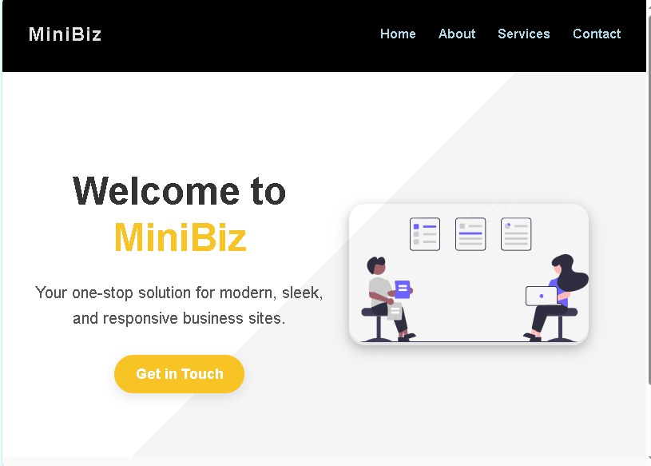

# 🛍️ MiniBiz — One-Stop Business Website

A clean, responsive demo business website built for small service-based businesses. This static site includes a homepage, service section, about page, and a working (mock) contact form.

---

## 🚀 Live Demo

👉 [https://chemene-coder.github.io/mini-biz-site/](https://chemene-coder.github.io/mini-biz-site/)

---

## 📌 Features

- ⚡ Fully responsive design
- 🎯 Clear call-to-action (Get in Touch)
- 🧱 Modular layout (HTML/CSS)
- 💬 Contact form with confirmation redirect (no email logic)
- 🎨 Simple and bold UI for business presentation

---

## 📂 Project Structure

mini-biz-site/
├── index.html
├── about.html
├── contact.html
├── contact-submit.html
├── assets/
│ ├── css/
│ │ └── style.css
│ ├── images/
│ │ ├── hero.svg
│ │ ├── client1.jpg
│ │ ├── client2.jpg 
│ │ ├── email.jpg
│ │ ├── landing.jpg
│ │ ├── webdesign.jpg
│ │ └── seo.jpg 

---

## 🛠️ Built With

- HTML5
- CSS3
- GitHub Pages for deployment

---

## 📸 Screenshots

*MiniBiz homepage preview (above-the-fold)*

---

## 📜 License

This project is open source and free to use for educational/demo purposes.

---

